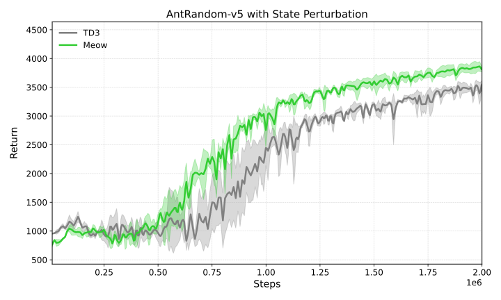
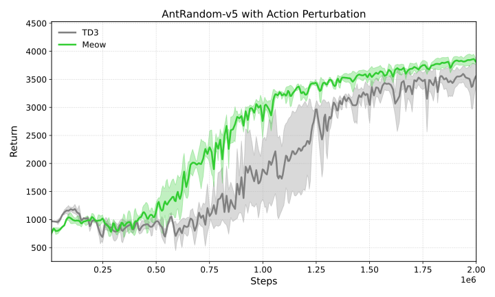
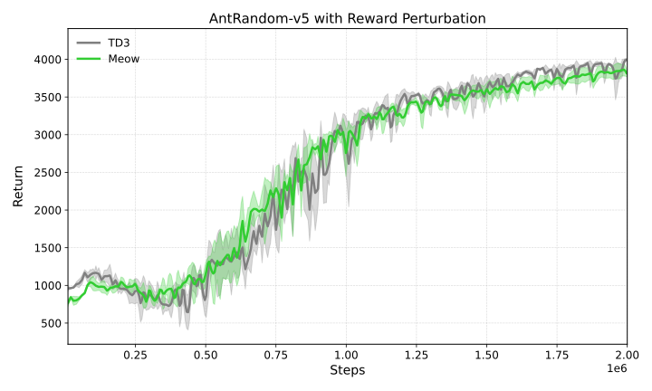

# Evaluating Robustness of MEow RL (NVIDIA Research, NeurIPS 2024) Under Real-World Noisy Conditions

##### Quick Reference:
| [About](#about)
| [Findings](#findings)
| [Dependencies and Installation](#dependencies-and-installation)
| [Running Experiments](#running-experiments)
| [Reproducing Figures](#reproducing-figures)
| [Acknowledgements](#acknowledgements)
| [References](#references)
| [Issues & Feedback](#issues--feedback)

## About

This project evaluates the robustness of Maximum Entropy Reinforcement Learning (MaxEnt RL) via Energy-Based Normalizing Flows (EBFlow). While RL algorithms are typically tested in clean, idealized simulations, this work introduces realistic disturbances including sensor corruption, action noise, and observation noise using tools from the Robust Gym benchmark to assess generalization. 

In this project, I benchmarked performance against baseline RL policies and analyzed performance degradation and stability across perturbation regimes. By applying rigorous robustness tests to state-of-the-art methods, the project highlights key challenges and explores applicability in realistic and safety-critical control settings, informing efforts toward safe, reliable deployment in the real world.

##### The goal is to:
- Stress-test popular RL methods under real-world-inspired conditions.
- Diagnose weaknesses in MaxEnt RL.
- Guide the development of more robust, deployable learning algorithms.

## Findings







All experimental results are reproducible via scripts in this repo. See [Reproducing Figures](#reproducing-figures).

## Dependencies and Installation

- Python 3.9
- [Robust Gymnasium](https://github.com/SafeRL-Lab/Robust-Gymnasium)

Clone and enter the repository:
```bash
git clone https://github.com/sophiebroderick/RobustMEow
cd RobustnessMEow
```

Create and activate a new environment:
```bash
uv init meowrobust --python 3.9
source .venv/bin/activate
```

Install dependencies:
```bash
bash setup.bash
uv sync
```

## Running Experiments

Both MEow and TD3 have been modified to output logs compatible with Robust Gym. Configuration files control environment settings, seeds, and training parameters.

**Example:** Run MEow on `AntRandom-v5`:
```bash
python meow_robust.py --config "config_meow_robust.yaml"
```

**Example:** Run TD3 on `AntRandom-v5`:
```bash
python td3_robust.py --config "config_td3_robust.yaml"
```

## Reproducing Figures

All raw data for figures can be found in the `/runs` directory.
To reproduce the evaluation plots run quick_plotter.py in the `/plots` directory

## Acknowledgements

This work builds on the following major libraries:

- [MEOw](https://github.com/ChienFeng-hub/meow) — Energy-Based Flows for MaxEnt RL (Forked and extended)
- [Robust Gymnasium](https://github.com/SafeRL-Lab/Robust-Gymnasium) — MuJoCo tasks with realistic noise and perturbation benchmarks
- [TD3 Baseline](https://github.com/vwxyzjn/cleanrl) — My TD3 variant is adapted from this implementation (Forked and extended)

## References

If you use this project, please consider citing the foundational work:

- **Eysenbach, B., & Levine, S.**  
  _Maximum Entropy RL (Provably) Solves Some Robust RL Problems_  
  ICLR 2022.  
  [arXiv:2103.06257](https://arxiv.org/abs/2103.06257)

  > This paper provides the first formal proof that MaxEnt RL maximizes a lower bound on a robust RL objective, showing that MaxEnt RL inherently offers robustness to certain types of disturbances—without requiring additional algorithmic components.

- **Ziebart, B. D., Maas, A., Bagnell, J. A., & Dey, A. K.**  
  _Maximum Entropy Inverse Reinforcement Learning_  
  AAAI Conference on Artificial Intelligence (AAAI-08), 2008.  
  [PDF](https://cdn.aaai.org/AAAI/2008/AAAI08-227.pdf)

  > This foundational work introduces the principle of maximum entropy for inverse reinforcement learning, establishing a probabilistic framework that inspires many modern MaxEnt RL algorithms.

## Issues & Feedback

Found a bug? Want to make a request or share your results?  
Please open an issue here: [GitHub Issues](https://github.com/SophieBroderick/RobustnessMEow/issues)
